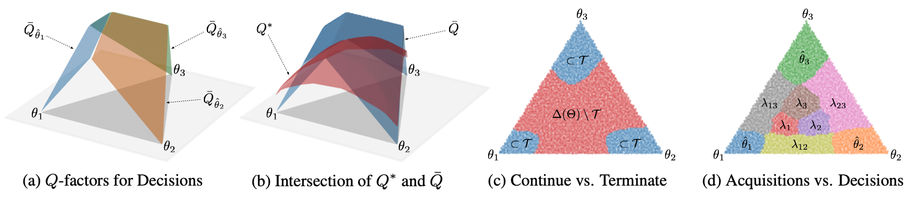
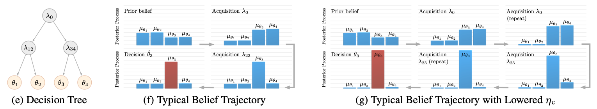
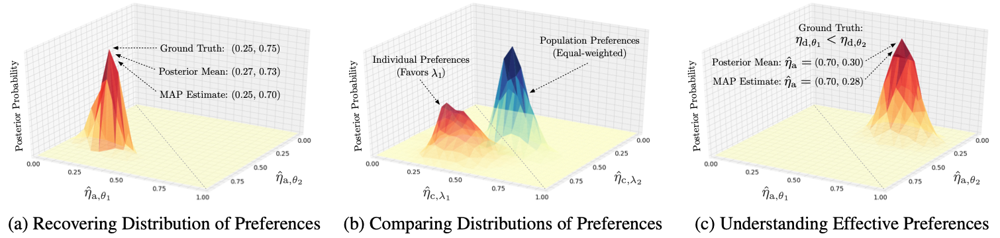
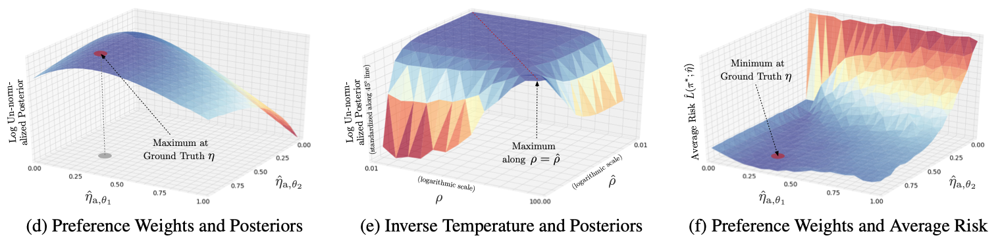

# [Inverse Active Sensing](http://proceedings.mlr.press/v119/jarrett20a.html)

### Daniel Jarrett, Mihaela van der Schaar

#### International Conference on Machine Learning (ICML) 2020

Code Author: Daniel Jarrett (dkj25@cam.ac.uk)

### Overview

This repository contains the necessary code to replicate the main experimental results in the ICML 2020 paper "[Inverse Active Sensing: Modeling and Understanding Timely Decision-Making](http://proceedings.mlr.press/v119/jarrett20a.html)." *Bayesian Inverse Active Sensing*, which is given as an example instance of inverse active sensing in the paper, is implemented in the file `learner/bayesian_mcmc_learner.py`.




### Usage

First, navigate to the directory `package/pomdp-sol/pomdp_sol/proc/`, and install *pomdp-solve v5.4* inside the empty directory `nix-solver` by following the instructions on [pomdp.org](https://www.pomdp.org/code/index.html). Make sure the executable `pomdp-solve` is located at `nix-solver/src/pomdp-solve`. Likewise, install *sarsop* inside the empty directory `nix-sarsop` by following the instructions on [adacompnus](https://github.com/AdaCompNUS/sarsop). Make sure the executable `pomdpsol` is located at `nix-sarsop/pomdpsol`.

Install the required python packages by running:

```
python3 -m pip install -r requirements.txt
```

For generating the figures, make sure you have Latex installed

```
sudo apt install texlive texlive-latex-extra texlive-fonts-recommended dvipng cm-super
```

Then, the main experimental results in the paper can be replicated by running:

```
make pack
make test
make driver
```

with the appropriate scenarios selected in the file `driver.py`. The selectable configurations are located in the file `config/decision.py` and `config/diagnosis.py`, and can be changed as needed.




### Dependencies

The following packages are needed for running the model:

- gym==0.15.3
- matplotlib==3.1.1
- numpy==1.17.3
- pandas==1.1.5
- scikit-learn==0.24.1
- scipy==1.5.2
- torch==1.7.1

### Reference

If you use this code, please cite:

```
@article{jarrett2020inverse,
  title = {Inverse Active Sensing: Modeling and Understanding Timely Decision-Making},
  author = {Jarrett, Daniel and van der Schaar, Mihaela},
  journal = {International Conference on Machine Learning},
  year = {2020},
}
```